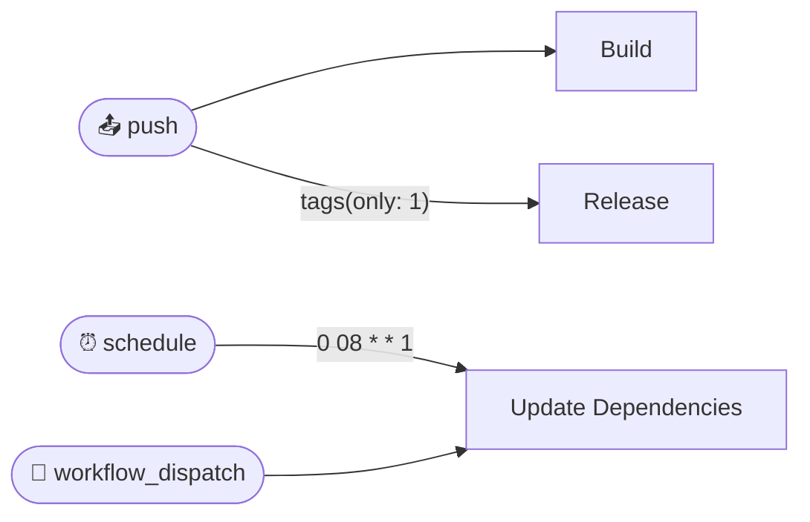

# Workflows

```mermaid
flowchart LR
    push(["📤 push"])
    schedule(["⏰ schedule"])
    workflowdispatch(["👤 workflow_dispatch"])
    buildyml["Build"]
    releaseyml["Release"]
    updatedependenciesyml["Update Dependencies"]
    push --> buildyml
    push -->|"tags(only: 1)"|releaseyml
    schedule -->|"0 08 * * 1"|updatedependenciesyml
    workflowdispatch --> updatedependenciesyml
```

## Workflows

- [Build](./build/)
- [Release](./release/)
- [Update Dependencies](./update-dependencies/)