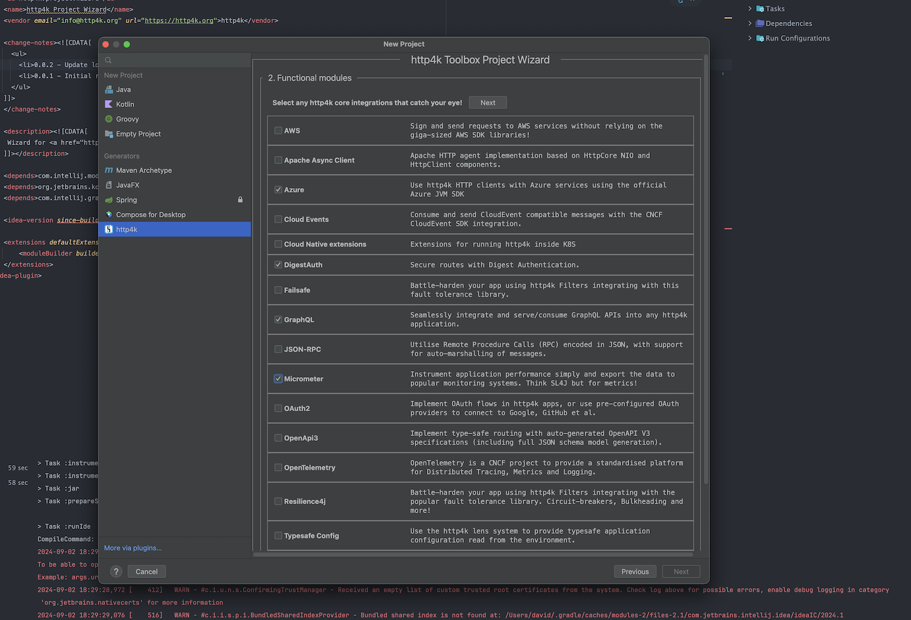

&nbsp;
&nbsp;
&nbsp;

## Functionality

### Generate http4k projects
Generates boilerplate http4k-based projects with ease by integrating a project wizard into IntelliJ IDEA. It streamlines the process of creating new
http4k projects by providing a user-friendly interface within the IDE and access to the [http4k Toolbox](https://toolbox.http4k.org).

#### How to use
Create a new IntelliJ project and select the **http4k** option from the left panel. The Wizard will guide you through a set of questions which will allow you
to select a bunch of modules from the http4k ecosystem, including build tooling.

The generated project will be fully functional, including template tests and a run configuration for the main application class.

### Generate http4k servers, clients and models from an OpenAPI spec  
The plugin provides a user-friendly interface to generate http4k code from an OpenAPI spec file. It supports both JSON and YAML formats.

#### How to use
Right click on a JSON or YAML file and select <b>New -> http4k -> OpenAPI to http4k</b>

### Generate data class models from JSON or YAML
The plugin provides a user-friendly interface to generate dataclass code from JSON and YAML files.</b>

#### How to use
Right click on a JSON or YAML file and select <b>New -> http4k -> Dataclasses</b>

### Generate data4k class models from JSON or YAML
The plugin provides a user-friendly interface to generate <a href="https://github.com/fork-handles/forkhandles/tree/trunk/data4k">data4k</a> wrapper code from JSON and YAML files.</b>

#### How to use
Right click on a JSON file and select <b>New -> http4k -> Dataclasses</b>

### Generate http4k request/response code from  a `.http` file
The plugin provides a user-friendly interface to generate Kotlin http4k HTTP message builder code from raw HTTP requests or responses.

#### How to use
Right click on a `.http` file and select <b>New -> http4k -> HTTP Request/Response</b>
